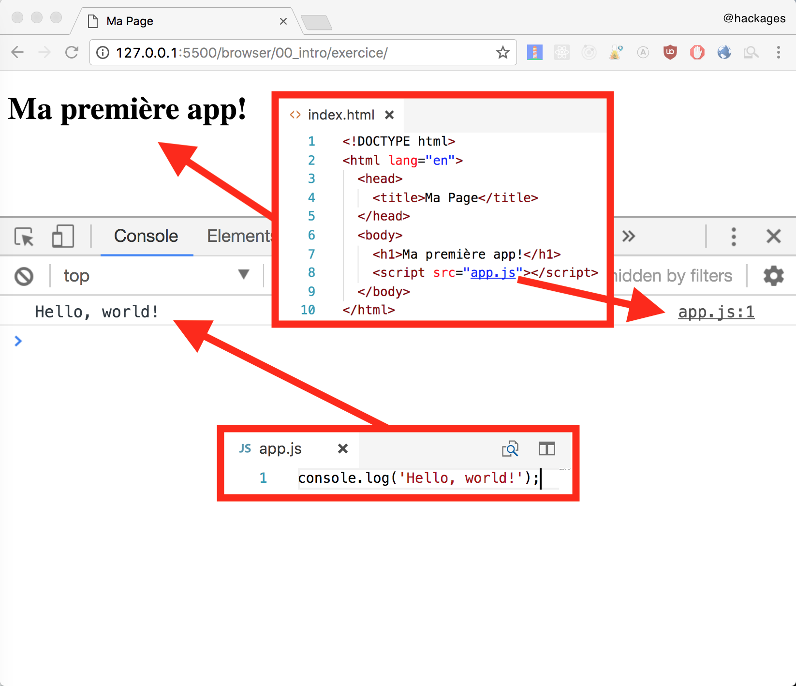

# JavaScript dans le Browser

## Sharify Technical Bootcamp: Week 3

Durant ce chapitre, nous allons vous apprendre à joindre HTML, CSS et JS.

## Inclure un fichier JavaScript dans une page web

```html
<!DOCTYPE html>
<html lang="en">
  <head>
    <title>Ma Page</title>
  </head>
  <body>
    <h1>Ma première application!</h1>
    <script src="app.js"></script>
  </body>
</html>
```

Pour ajouter nos scripts JavaScript sur une page web, il suffit de créer un tag **script** dans lequel on va ajouter un attribut **src** pointant sur notre fichier JavaScript.

Si par exemple nous incluons le fichier suivant:

```JS
console.log('Hello, world!');
```

Nous aurons ce résultat:


## Exercice

Créer dans le dossier exercice un index.html ainsi qu'un fichier JavaScript qui affichera votre nom dans un popup

[Indice](https://developer.mozilla.org/en-US/docs/Web/API/Window/alert)